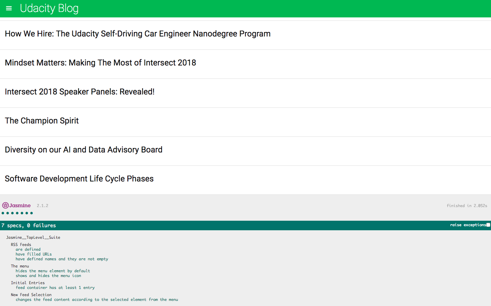
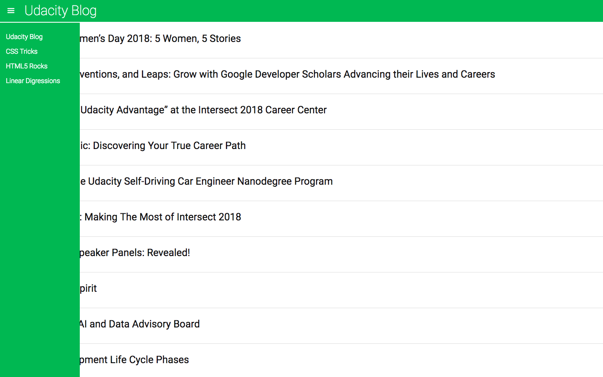

# Front end testing project

A tested application that interacts with the Google Feeder API 


## How to use
You can run locally: 

```
clone repository
$ cd frontend-nanodegree-feedreader
$ open index.html 
```

## Features

The test results are shown on same page as the feedreader:


